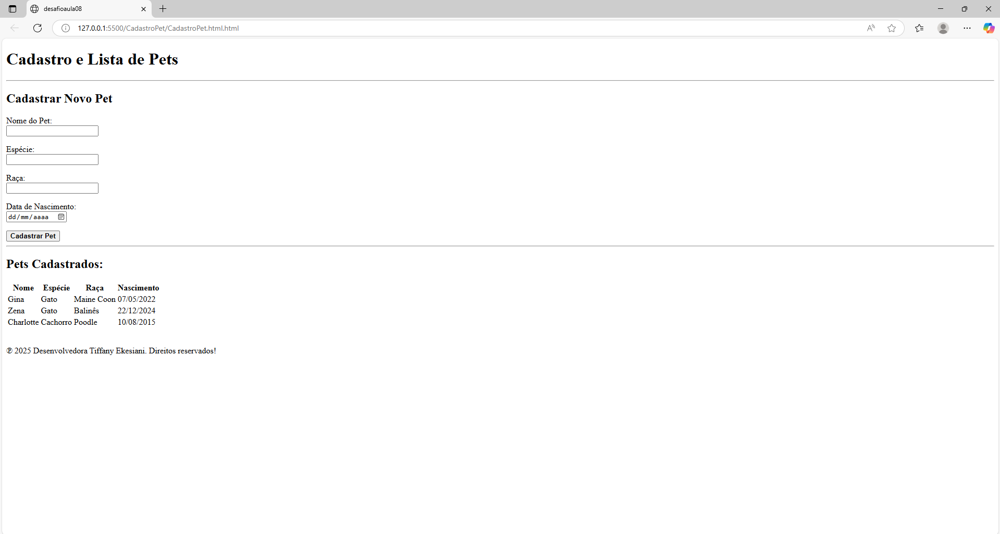

# 🐾 Cadastro de Pets - Projeto HTML

Este é um projeto simples feito em HTML, desenvolvido como parte dos meus estudos iniciais em desenvolvimento web. A página permite o **cadastro de um novo pet** e exibe uma **lista de pets já cadastrados** em uma tabela.

## 💡 Funcionalidades

- Formulário para cadastrar informações do pet:
  - Nome
  - Espécie
  - Raça
  - Data de nascimento
- Exibição dos pets cadastrados em uma tabela organizada

## 🛠️ Tecnologias utilizadas

- HTML5  
*(Projeto estático, sem JavaScript ou backend)*

## 📷 Prévia do projeto

## 📁 Como visualizar

Você pode visualizar o projeto abrindo o arquivo `index.html` diretamente no navegador.  
Ou acessar via GitHub Pages se estiver publicado.

## 📌 Status

🚧 Projeto simples finalizado – pode evoluir com JavaScript futuramente! 🚀

---

## 👩🏽‍💻 Desenvolvido por

  <b style="color:#ff69b4">Tiffany Ekesiani</b> 🾠
  <a href="https://github.com/tiffanyekesiani" target="_blank">GitHub</a> |
  <a href="https://www.linkedin.com/in/tiffanyekesiani" target="_blank">LinkedIn</a>

